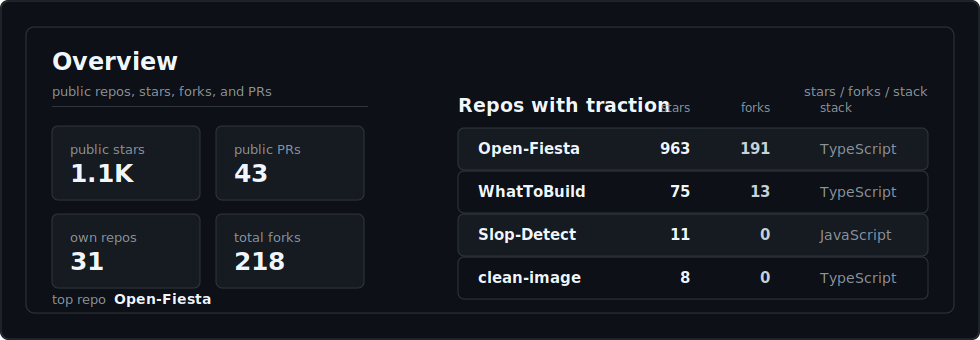

<h1 align="center">Niladri Hazra</h1>

  Full-stack and mobile engineer building product surfaces, backend systems, and AI-agent workflows that hold up in real use.

  <a href="https://niladri.in">niladri.in</a>
  &nbsp;·&nbsp;
  <a href="https://x.com/btyehumi">@btyehumi</a>
  &nbsp;·&nbsp;
  <a href="https://linkedin.com/in/btyehumi">LinkedIn</a>

### What I work on

I build full-stack and mobile products, mostly in TypeScript. The useful work is usually between the screen and the systems behind it: React and React Native clients, background jobs, data models, integrations, and agent flows that can survive real users.

I like fast feedback loops, strict types, small APIs, and code that is still easy to change after the first version ships.

### Stack

TypeScript, Bun, React, Vite, TanStack Router, TanStack Query, React Native, Expo, Postgres, Drizzle, Better Auth, Tailwind, Radix, Trigger.dev, and Vercel AI SDK.

For model work I use OpenAI, Anthropic, Google, Bedrock, or Vertex. For integrations I usually end up around Discord, Slack, Telegram, iMessage, or Teams.

### Right now

- Building web and mobile surfaces that feel fast.
- Wiring agent workflows into actual product paths.
- Keeping jobs, data, and integrations simple enough to maintain.

### GitHub signal

<!-- signal:start -->
<picture>
  <source media="(max-width: 700px)" srcset="./assets/profile-signal-mobile.svg" />
  
</picture>
<!-- signal:end -->
